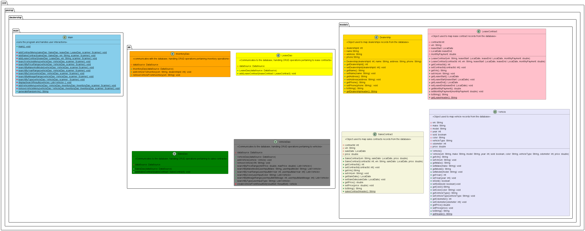
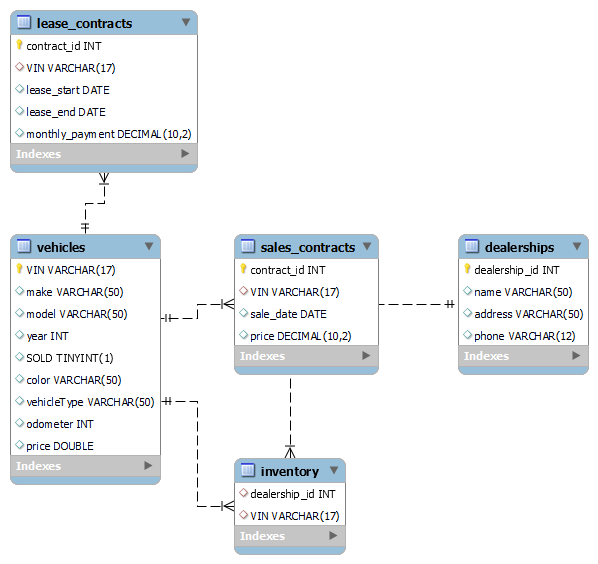

# Car Dealership Management System

## Overview
This project is a Java-based application designed to manage a car dealership's inventory, sales, and leases. It interacts with a MySQL database to perform CRUD operations and offers a command-line interface for user interactions.

## Class Diagram
The class diagram provides a high-level view of the classes and their relationships within the system.

<figure>
   
   <figcaption><i>Class diagram</i></figcaption>
</figure>

### Main Classes
- **Main**: Entry point of the application. It handles user interactions and coordinates the actions between different DAO classes.
- **VehicleDao**: Handles CRUD operations related to vehicles.
- **InventoryDao**: Manages the inventory, including adding and removing vehicles.
- **SalesDao**: Manages sales contracts.
- **LeaseDao**: Manages lease contracts.
- **SalesContract**: Represents a sales contract record.
- **LeaseContract**: Represents a lease contract record.
- **Vehicle**: Represents a vehicle record.

### Main Class Methods
- `main()`: Initializes the application, processes user inputs, and directs to appropriate methods.
- `addContractMenu()`: Guides the user through adding a sales or lease contract.
- `addSalesContract()`: Handles the creation and addition of a sales contract.
- `addLeaseContract()`: Handles the creation and addition of a lease contract.
- `searchVehiclesMenu()`: Provides various options to search for vehicles.
- `addVehicleMenu()`: Guides the user through adding a new vehicle.
- `removeVehicleMenu()`: Guides the user through removing a vehicle.
- `generateRandomVin()`: Generates a random VIN for new vehicles.

## Project demo

<figure>
   
</figure>

## Database Diagram
The database diagram illustrates the structure of the database and the relationships between tables.

<figure>
   
   <figcaption><i>Database diagram</i></figcaption>
</figure>

### Tables
- **vehicles**: Stores vehicle details such as VIN, make, model, year, color, mileage, type, and price.
- **sales_contracts**: Stores sales contract details including contract ID, VIN, sale date, and price.
- **lease_contracts**: Stores lease contract details including contract ID, VIN, lease start and end dates, and monthly payment.
- **inventory**: Manages the association between vehicles and dealerships.
- **dealerships**: Stores dealership details such as dealership ID, name, address, and phone.

### Relationships
- Vehicles are linked to `sales_contracts` and `lease_contracts` via the `VIN`.
- Vehicles are associated with `dealerships` through the `inventory` table, which links a `VIN` to a `dealership_id`.

## How to Run
1. Ensure you have Java and MySQL installed and properly configured.
2. Clone the repository and navigate to the project directory.
3. Set up the MySQL database using the provided schema.
4. Modify the database connection settings in the code (if necessary).
5. Compile and run the `Main` class

## Usage
Upon running the application, you will be presented with a menu to:
- Search for vehicles.
- Add a new vehicle.
- Add a sales or lease contract.
- Remove a vehicle.
- Exit the application.

Follow the prompts to interact with the system.

## Dependencies
- Java 8 or higher
- MySQL JDBC Driver
- MySQL Database

## Technologies Used
- Java 21
- MySQL Workbench 8.0 Community Edition
- Intellij IDEA 24.1 Community Edition
- Git Bash 2.39.1.windows.1

## Author
- Paul Tunda

## Acknowledgments
- Thanks to my instructor, Raymond for his continuous support and guidance.
- Thanks to my classmates for your dedication and commitment.
